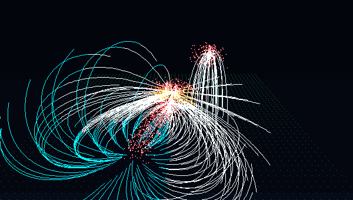
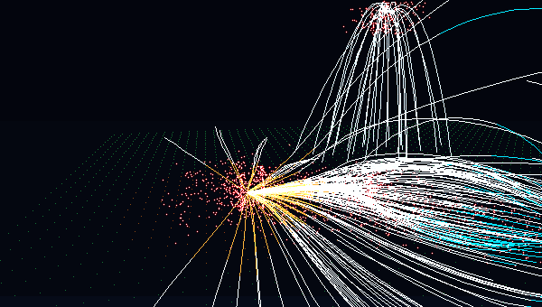

# CosmoFlow 🌌

> **Interactive Real-Time 3D WebGL Visualization of the Laniakea Supercluster & Cosmic Velocity Flows**  
> Based on cosmological research by *Tully et al. (Nature 2014)* and *Hoffman et al. (Nature Astronomy 2017)*.

[](https://epic-hubble.vercel.app)
[](https://threejs.org/)
[](https://vitejs.dev/)
[](LICENSE)

---

## 🚀 Live Interactive Demo
👉 **[Launch CosmoFlow (https://epic-hubble.vercel.app)](https://epic-hubble.vercel.app)**


*360° orbital view of the Laniakea Supercluster showing cosmic velocity streamlines converging into The Great Attractor from the Dipole Repeller void.*

---

## 📖 Astrophysical Background

In 2014, an international team led by astronomer R. Brent Tully mapped over 8,000 peculiar velocities of galaxies in our local universe, revealing the **Laniakea Supercluster** (Hawaiian for *"immense heaven"*). Laniakea spans over 520 million light-years and contains approximately $10^{17}$ solar masses.

CosmoFlow models the cosmological peculiar velocity field $\vec{v}(\vec{r})$ derived from the gravitational potential gradient:

$$\vec{v}(\vec{r}) = -\nabla \Phi(\vec{r}) + \vec{v}_{\text{drift}}$$

where the potential field $\Phi(\vec{r})$ is governed by major gravitational attractors and repulsive underdensities (voids):

$$\Phi(\vec{r}) = -\sum_{i=1}^{N_a} \frac{G M_i}{(|\vec{r} - \vec{r}_i|^2 + \epsilon_i^2)^{1/2}} + \sum_{j=1}^{N_r} \frac{G |R_j|}{(|\vec{r} - \vec{r}_j|^2 + \epsilon_j^2)^{1/2}}$$

### Numerical Runge-Kutta 4th Order (RK4) Streamline Tracing
Streamlines are numerically integrated forward along the 3D velocity gradient using adaptive RK4 steps:

$$\vec{x}_{n+1} = \vec{x}_n + \frac{\Delta t}{6} \left(\vec{k}_1 + 2\vec{k}_2 + 2\vec{k}_3 + \vec{k}_4\right)$$

$$\vec{k}_1 = \vec{v}(\vec{x}_n), \quad \vec{k}_2 = \vec{v}\left(\vec{x}_n + \frac{\Delta t}{2}\vec{k}_1\right), \quad \vec{k}_3 = \vec{v}\left(\vec{x}_n + \frac{\Delta t}{2}\vec{k}_2\right), \quad \vec{k}_4 = \vec{v}\left(\vec{x}_n + \Delta t \vec{k}_3\right)$$

---

## 🌟 Key Features


*Cinematic flythrough highlighting the Coma cluster high-latitude vertical fountain loops and Centaurus hub.*

### 1. 🏷️ 12 Authentic Astronomical 3D Billboard Labels
- **Core Hub & Convergence**: `The Great Attractor`, `Centaurus`
- **Superclusters & Local Group**: `Virgo`, `Milky Way (You Are Here)`
- **High-Latitude Apex**: `Coma Cluster`
- **Galaxy Clusters**: `Hydra`, `Antlia`, `NGC 5016 Cluster`
- **Abell Concentrations**: `Abell 3574`, `Abell 3565`, `Abell 50753`
- **Cosmic Flow Direction**: `Bulk flow toward Antlia-Centaurus`
- Rendered with high-DPI canvas typography, camera-facing billboard orientation, depth-scaling, and hairline cluster leader lines.

### 2. 🌌 Coma Vertical Fountain Loops
- Upward-arching parabolic streamlines ascending from the supergalactic plane up to high latitudes ($Y \approx 45 \dots 58$) into the Coma cluster.

### 3. 🎨 Multi-Hue Scientific Velocity Gradient
- **Electric Cyan & Royal Blue**: Foreground outflow basin near Milky Way and Antlia.
- **Crisp Silvery-White**: Inter-cluster filament bridges across the supergalactic plane.
- **Warm Gold & Fiery Crimson**: Velocity convergence vortex funnelling into Centaurus and The Great Attractor.

### 4. 🔮 3D Shaded Cluster Spheres & 18,000+ Galaxy Swarm
- Instanced glossy 3D spheres representing major galaxy clusters with directional lighting and specular sheen.
- Virial density clustering around Virgo, Coma, Hydra, Antlia, and Centaurus cores.

### 5. 🎬 Deterministic 360° Seamless Loop GIF & WebM Studio
- Built-in client-side recording engine powered by `gifenc`.
- Renders mathematically perfect 360° orbital loops (frame 0 connects seamlessly to final frame).
- Presets for duration (3s, 4s, 6s) and resolution (480p, 720p).
- Instant in-browser preview modal with 1-click `.GIF` and `.WEBM` download buttons.

### 6. 🔄 Automated 3D Orbit Controls & Smart Resume
- Automated 360-degree turntable orbit around the supergalactic center.
- **Smart Interactive Resume**: Automatically pauses when interacting with the mouse, and seamlessly resumes after 2 seconds of inactivity.
- **6 Viewport Presets**: *Reference (Tully 2014)*, *Coma Fountain Arch*, *Virgo Cluster*, *Great Attractor Core*, *Top-Down Plane*, and *Dipole Repeller Outflow*.

---

## 🛠 Project Architecture

```
cosmo-flow/
├── src/
│   ├── camera/
│   │   └── CameraController.js     # Auto-orbit, smart resume & cinematic tours
│   ├── physics/
│   │   └── CosmicField.js          # Potential field math & RK4 numerical tracer
│   ├── recorder/
│   │   └── GifRecorder.js          # Deterministic 360° GIF & WebM capture engine
│   ├── renderers/
│   │   ├── ClusterEllipsoids.js    # 3D shaded cluster spheres
│   │   ├── CosmicLabels.js         # 12 camera-facing 3D billboard labels
│   │   ├── CosmicSkybox.js         # Distant starry cosmos & reference axes
│   │   ├── GalaxyClusters.js       # Cluster node meshes
│   │   ├── GalaxySwarm.js          # 18,000+ filamentary galaxy particles
│   │   ├── SlicePlaneMesh.js       # GPU GLSL potential colormap shader slice
│   │   └── StreamlineRenderer.js   # Cosmic streamlines, cones & Coma loops
│   ├── ui/
│   │   ├── ControlPanel.js         # lil-gui astrophysical parameter studio
│   │   ├── RecorderModal.js        # GIF/WebM preview & download dialog
│   │   └── RecordingDock.js        # Floating HUD recording studio dock
│   ├── main.js                     # Three.js scene loop & postprocessing
│   └── style.css                   # Glassmorphic observatory HUD styling
├── docs/
│   └── assets/                     # Animated preview GIFs
├── index.html                      # Viewport container & scientific HUD
└── package.json
```

---

## ⚡ Quickstart

### Prerequisites
- Node.js 18+
- npm or pnpm

### Installation
```bash
# Clone the repository
git clone https://github.com/zrt219/cosmo-flow.git
cd cosmo-flow

# Install dependencies
npm install

# Start local development server
npm run dev
```

Open `http://localhost:3000` in your browser.

### Production Build
```bash
npm run build
npm run preview
```

---

## 📚 References & Further Reading
1. **Tully, R. B., Courtois, H., Hoffman, Y., & Pomarède, D. (2014).**  
   *The Laniakea supercluster of galaxies.* Nature, 513(7516), 71-73. [doi:10.1038/nature13674](https://doi.org/10.1038/nature13674)
2. **Hoffman, Y., Courtois, H. M., Tully, R. B., & Pomarède, D. (2017).**  
   *The Dipole Repeller.* Nature Astronomy, 1(2), 0036. [doi:10.1038/s41550-016-0036](https://doi.org/10.1038/s41550-016-0036)
3. **Pomarède, D., et al. (2017).**  
   *Cosmicflows-3: The Dipole Repeller and the Cold Spot Repeller.* The Astrophysical Journal, 880(2), 154.

---

## 📄 License
This project is open-source under the [MIT License](LICENSE).
