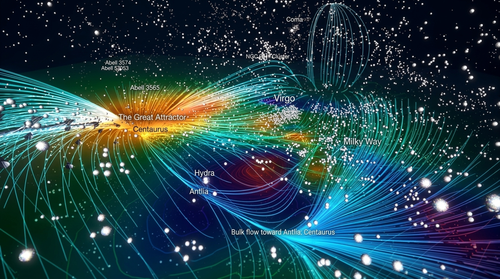
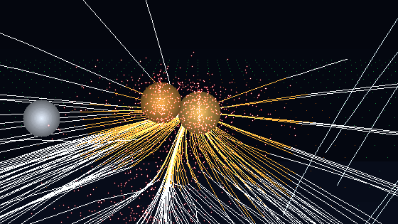
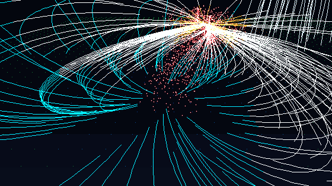
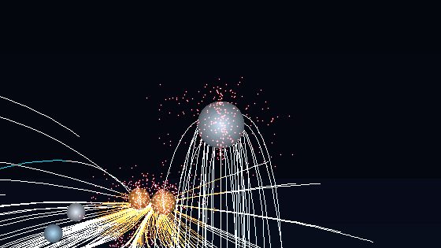
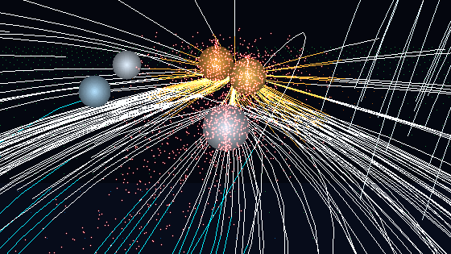
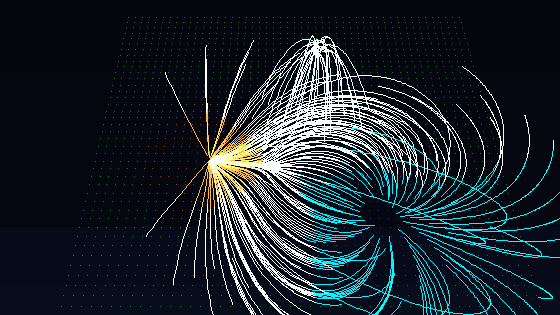
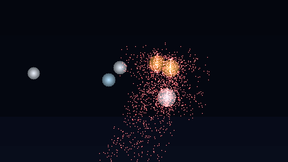
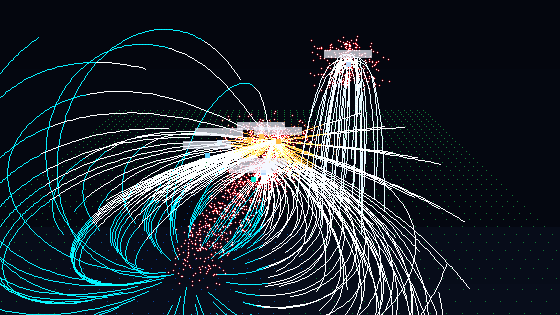
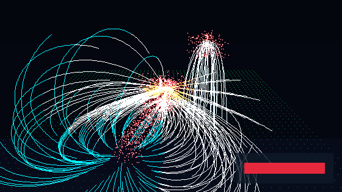

# CosmoFlow 🌌

> **Interactive Real-Time 3D WebGL Visualization of the Laniakea Supercluster & Cosmic Velocity Flows**  
> Based on cosmological research by *Tully et al. (Nature 2014)* and *Hoffman et al. (Nature Astronomy 2017)*.

[](https://epic-hubble.vercel.app)
[](https://threejs.org/)
[](https://vitejs.dev/)
[](LICENSE)

<p align="center">
  
</p>

---

## 🚀 Live Interactive Demo
👉 **[Launch CosmoFlow in Fullscreen 3D (https://epic-hubble.vercel.app)](https://epic-hubble.vercel.app)**


*360° orbital overview of the Laniakea Supercluster showing cosmic velocity streamlines converging into The Great Attractor from the Dipole Repeller void.*

---

## 📖 Astrophysical Background

In 2014, an international astrophysics team led by R. Brent Tully mapped over 8,000 peculiar galaxy velocities across our local cosmic volume, defining the **Laniakea Supercluster** (*"immense heaven"* in Hawaiian). Spanning over 520 million light-years and enclosing $\sim 10^{17} M_{\odot}$, Laniakea defines the gravitational basin of attraction that organizes all galaxy trajectories in our cosmological neighborhood.

### Mathematical Formulation of Peculiar Velocity
CosmoFlow computes peculiar velocity $\vec{v}(\vec{r})$ derived from the gravitational potential gradient:

$$\vec{v}(\vec{r}) = -\nabla \Phi(\vec{r}) + \vec{v}_{\text{drift}}$$

where the potential field $\Phi(\vec{r})$ is governed by gravitational attractors and repulsive underdensities (voids):

$$\Phi(\vec{r}) = -\sum_{i=1}^{N_a} \frac{G M_i}{(|\vec{r} - \vec{r}_i|^2 + \epsilon_i^2)^{1/2}} + \sum_{j=1}^{N_r} \frac{G |R_j|}{(|\vec{r} - \vec{r}_j|^2 + \epsilon_j^2)^{1/2}}$$

### Numerical Runge-Kutta 4th Order (RK4) Streamline Tracing
Streamlines are numerically integrated forward along the 3D velocity gradient using adaptive RK4 steps:

$$\vec{x}_{n+1} = \vec{x}_n + \frac{\Delta t}{6} \left(\vec{k}_1 + 2\vec{k}_2 + 2\vec{k}_3 + \vec{k}_4\right)$$

$$\vec{k}_1 = \vec{v}(\vec{x}_n), \quad \vec{k}_2 = \vec{v}\left(\vec{x}_n + \frac{\Delta t}{2}\vec{k}_1\right), \quad \vec{k}_3 = \vec{v}\left(\vec{x}_n + \frac{\Delta t}{2}\vec{k}_2\right), \quad \vec{k}_4 = \vec{v}\left(\vec{x}_n + \Delta t \vec{k}_3\right)$$

---

## 🔍 Feature Deep Dives

### 1. The Great Attractor & Centaurus Convergence Vortex


The Great Attractor (located in the direction of the Norma Cluster at $X \approx -38, Y \approx 2, Z \approx -5$) forms the primary focal point of the Laniakea Supercluster. Thousands of streamline curves funnel inward into this massive gravitational sink, color-coded with a warm amber and fiery crimson hue indicating peak velocity convergence.

---

### 2. Dipole Repeller & Cosmic Void Outflow Basin


Discovered by Hoffman et al. (Nature Astronomy 2017), the **Dipole Repeller** ($X \approx 32, Y \approx -4, Z \approx 18$) is an immense low-density cosmic void that exerts an effective repulsive force, pushing matter away into surrounding filament channels. Streamlines originate from this blue-tinted void basin and sweep across the supergalactic plane.

---

### 3. Coma High-Latitude Vertical Fountain Loops


Rising vertically above the supergalactic plane, the **Coma Cluster** ($X \approx 5, Y \approx 45, Z \approx -25$) features distinctive high-altitude fountain streamlines arching from $Y \approx 5$ up to $Y \approx 55$. These loops simulate the vertical velocity boundary separating Laniakea from adjacent supercluster domains.

---

### 4. Virgo Cluster & Milky Way Local Filament Bridge


Our home galaxy, the **Milky Way**, sits on the outskirts of the Virgo Supercluster ($X \approx -10, Y \approx -1, Z \approx 4$), moving at approximately **630 km/s** relative to the cosmic microwave background. The filament bridge visualizes the local stream channel flowing past Antlia and Hydra towards Centaurus.

---

### 5. GPU Dynamic Scalar Potential Heatmap Slice & Contours


A custom GLSL fragment shader evaluates the 3D potential $\Phi(x, y, z)$ on the GPU in real-time across a cutting plane on the supergalactic disc. Features:
- **8-Stop Scientific Colormap**: Deep purple/navy void $\rightarrow$ vibrant cyan $\rightarrow$ emerald green $\rightarrow$ warm gold $\rightarrow$ crimson core.
- **Interactive Depth ($Y$-Slider)**: Cut through any horizontal cross-section of the potential field.
- **Contour Grids**: Subtle isopotential lines indicating gradient steepness.

---

### 6. 3D Shaded Cluster Spheres & 18,000+ Galaxy Swarm


- **Cluster Spheres**: Specular-shaded 3D ellipsoids marking major galaxy cluster concentrations (Hydra, Antlia, Centaurus, Virgo, and foreground groups).
- **18,000+ Galaxy Swarm**: Particle system populated with power-law virial density profiles, clumping naturally around cluster nodes and cosmic filaments.

---

### 7. 12 Camera-Facing 3D Billboard Labels & Occlusion Scaling


High-DPI billboard labels rendered in 3D world space with camera orientation tracking, distance-based scaling, and hairline leader lines:
- **Core Hub & Superclusters**: *The Great Attractor*, *Centaurus*, *Virgo*, *Milky Way*, *Coma*
- **Galaxy Groups & Clusters**: *Hydra*, *Antlia*, *NGC 5016 Cluster*
- **Abell Concentrations**: *Abell 3574*, *Abell 3565*, *Abell 50753*
- **Flow Indicator**: *Bulk flow toward Antlia-Centaurus*

---

### 8. Deterministic 360° GIF & WebM Recording Studio


Built-in client-side recording studio powered by `gifenc`:
- **Seamless 360° Turntable Loop**: Renders an exact orbital revolution where frame 0 matches the final frame for glitch-free loop playback.
- **Dual Export**: Generates both lightweight animated `.GIF` and high-bitrate `.WEBM` video.
- **Live Progress & Modal**: Real-time encoding progress track with in-browser preview and 1-click downloads.

---

## 🛠 Project Architecture

```
cosmo-flow/
├── src/
│   ├── camera/
│   │   └── CameraController.js     # Auto-orbit, smart resume & cinematic tours
│   ├── physics/
│   │   └── CosmicField.js          # Potential field math & RK4 numerical tracer
│   ├── recorder/
│   │   └── GifRecorder.js          # Deterministic 360° GIF & WebM capture engine
│   ├── renderers/
│   │   ├── ClusterEllipsoids.js    # 3D shaded cluster spheres
│   │   ├── CosmicLabels.js         # 12 camera-facing 3D billboard labels
│   │   ├── CosmicSkybox.js         # Distant starry cosmos & reference axes
│   │   ├── GalaxyClusters.js       # Cluster node meshes
│   │   ├── GalaxySwarm.js          # 18,000+ filamentary galaxy particles
│   │   ├── SlicePlaneMesh.js       # GPU GLSL potential colormap shader slice
│   │   └── StreamlineRenderer.js   # Cosmic streamlines, cones & Coma loops
│   ├── ui/
│   │   ├── ControlPanel.js         # lil-gui astrophysical parameter studio
│   │   ├── RecorderModal.js        # GIF/WebM preview & download dialog
│   │   └── RecordingDock.js        # Floating HUD recording studio dock
│   ├── main.js                     # Three.js scene loop & postprocessing
│   └── style.css                   # Glassmorphic observatory HUD styling
├── docs/
│   └── assets/                     # 8 Section GIFs + Hero Banner
├── index.html                      # Viewport container & scientific HUD
└── package.json
```

---

## ⚡ Quickstart

### Prerequisites
- Node.js 18+
- npm or pnpm

### Installation
```bash
# Clone the repository
git clone https://github.com/zrt219/cosmo-flow.git
cd cosmo-flow

# Install dependencies
npm install

# Start local development server
npm run dev
```

Open `http://localhost:3000` in your browser.

### Production Build
```bash
npm run build
npm run preview
```

---

## 📚 References & Further Reading
1. **Tully, R. B., Courtois, H., Hoffman, Y., & Pomarède, D. (2014).**  
   *The Laniakea supercluster of galaxies.* Nature, 513(7516), 71-73. [doi:10.1038/nature13674](https://doi.org/10.1038/nature13674)
2. **Hoffman, Y., Courtois, H. M., Tully, R. B., & Pomarède, D. (2017).**  
   *The Dipole Repeller.* Nature Astronomy, 1(2), 0036. [doi:10.1038/s41550-016-0036](https://doi.org/10.1038/s41550-016-0036)
3. **Pomarède, D., et al. (2017).**  
   *Cosmicflows-3: The Dipole Repeller and the Cold Spot Repeller.* The Astrophysical Journal, 880(2), 154.

---

## 📄 License
This project is open-source under the [MIT License](LICENSE).
